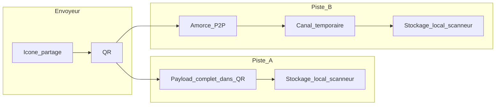

# Capture fonctionnelle — partage recette pair-à-pair (sans serveur de contenu)

Document de **capture d’idées et de besoins** (pas un plan d’implémentation). Statut : **hors périmètre v1** ; voir [SPEC.md](../SPEC.md) (hors scope partage sortant / synchro cloud). Quand la fonctionnalité sera **priorisée**, mettre à jour [SPEC.md](../SPEC.md), [DOMAIN.md](../DOMAIN.md), [ARCH.md](../ARCH.md) et ajouter un **ADR** (arbitrage piste QR tout-en-un vs P2P, politique médias).

## Besoin clarifié

- **Transférer une recette** d’un appareil à un autre **sans la charger sur un serveur** (pas de stockage « cloud recette », pas de relais applicatif des données recette).
- **UX cible** : une **icône de partage sur chaque recette** qui expose un **QR code** ; une autre instance de l’app **Cookies & Coquillettes** le scanne depuis l’**écran d’accueil** (flux « recevoir une recette » / caméra intégrée ou délégation OS selon plateforme — détail UX à cadrer plus tard).
- **Deux pistes techniques** (non exclusives sur le long terme ; à arbitrer ou combiner par cas) :
  1. **QR « tout-en-un »** : le QR encode **tout le nécessaire** pour que l’appareil qui scanne **persiste la recette en local** (schéma domaine + métadonnées ; images en base64 ou absentes si trop lourd).
  2. **QR comme amorce** : le QR ne contient pas toute la recette mais permet d’**ouvrir un canal pair-à-pair temporaire** pour transférer les données (WebRTC Data Channel ou équivalent) ; le serveur, s’il existe, ne porte **que** de la signalisation / rendez-vous, **jamais** le corps de la recette.

## Contexte produit actuel

- Stockage **local-only**, **sans compte** — cohérent avec un partage **éphémère** et **sans backend métier** pour le contenu.
- **Hors périmètre v1** aujourd’hui : partage social sortant, synchro cloud. Cette idée reste une **évolution future** jusqu’à intégration dans SPEC.

## Référence Matchpoint (inspiration UX seulement)

- Projet **Matchpoint** (dépôt séparé) : **QR + code court** pour ouvrir l’app sur le second appareil, avec un **backend qui relaie** tout le trafic entre affichage et télécommande.
- **Pour C&C** : on retient surtout l’**habitude utilisateur** « je montre un QR, l’autre scanne avec la même app ». On **n’impose pas** un relais serveur pour les **données recette** ; le relais type Matchpoint n’est **pas** l’hypothèse par défaut de cette capture.

## Slices de besoins

### Slice A — Vision

- **Une recette à la fois** pour le périmètre initial de l’idée (multi-recettes = extension ultérieure).
- **Aucun hébergement de la recette sur un serveur** au sens « upload du contenu » ; objectif confidentialité et alignement « données chez l’utilisateur ».

### Slice B — UX

- **Icône de partage** sur la recette (carte liste et/ou détail — à préciser).
- Affichage d’un **QR** côté envoyeur ; côté receveur, entrée depuis l’**accueil** pour **scanner** et **importer** en local.
- Messages utilisateur si QR **illisible**, **expiré** (si P2P avec TTL), ou **format non reconnu**.

### Slice C — Piste 1 : tout dans le QR

- **Avantages** : pas de serveur du tout ; fonctionne **hors ligne** une fois le QR affiché (le flux « scan » suppose souvent les deux appareils présents).
- **Contraintes** : limites de **capacité** et de **fiabilité de scan** des QR (ordre de grandeur kilo-octets selon version et correction d’erreur) ; les **images** (recette, étapes) gonflent vite la charge utile — à documenter : recette **texte seule** vs **réduction d’images** vs **hors périmètre** pour cette piste.
- Format : URL custom scheme ou `https` profond avec fragment / param compressé — **décision plus tard** ; l’important est le besoin « décodage → création locale ».

### Slice D — Piste 2 : QR amorce + P2P temporaire

- Le QR contient une **poignée minimale** (token de session, clés de signalisation, ou équivalent) pour établir un **canal direct** entre les deux navigateurs / apps.
- **Données recette** (y compris gros blobs) transitent **uniquement** sur ce canal ; si un serveur existe, il ne voit **pas** le corps de la recette (signaling / STUN seulement selon design).
- **Contraintes** : NAT, réseaux distincts, besoin éventuel de **TURN** (souvent relais binaire — à traiter comme **sous-arbitrage** : accepter TURN tiers minimal vs refuser et message d’échec).

### Slice E — Intégration locale côté receveur

- Création d’une **nouvelle recette** en base locale (nouveaux IDs), avec **provenance** explicite « reçue par partage pair-à-pair » (détail DOMAIN quand priorisé).
- Comportement si recette **identique** ou **même titre** : doublon autorisé ou suggestion de fusion — **hors arbitrage** pour cette capture.

### Slice F — Confiance et surface d’attaque

- Qui scanne le QR **obtient** la recette (comme un secret affiché à l’écran) — acceptable si usage **proximité** ; pas d’authentification forte dans l’idée initiale.
- Si P2P : durée de vie du rendez-vous, **un seul** pair connecté ou file — à trancher.

### Slice G — Non-objectifs

- Pas de fil social, pas de catalogue public, pas de synchro continue multi-appareils.
- Pas d’obligation de **serveur C&C** pour le partage si la piste « tout QR » suffit pour un sous-ensemble de cas (ex. recettes sans médias lourds).

### Slice H — Alignement docs quand la feature sera priorisée

- [SPEC.md](../SPEC.md), [DOMAIN.md](../DOMAIN.md), [ARCH.md](../ARCH.md) + **ADR** : arbitrage **piste 1 vs 2** (ou hybride : petite recette en QR, grosse en P2P), et politique **médias**.

## Décisions à ne pas préempter ici

- Seuil de taille pour forcer P2P vs QR.
- Présence ou non d’un **signaling** minimal hébergé.
- Stratégie **images** (incluses, réduites, exclues de la piste QR).
